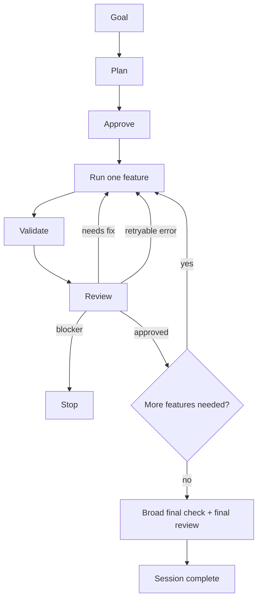

# Flow Plugin for OpenCode

`opencode-plugin-flow` adds a planning-and-execution workflow to OpenCode that adapts from small one-shot tasks to reviewed multi-feature delivery.

## What Flow does

- Turns a goal into a **tracked session** with a plan of features, stored on disk.
- Executes **one feature at a time** with validation and review checks.
- **Scales automatically**: small tasks run nearly one-shot; larger work picks up a plan, reviewer sign-off, and a broad final check — without you having to configure anything.

## When to use it

Use Flow when you want:

- a visible plan before code changes happen
- one feature at a time, with validation evidence recorded
- reviewer-gated progression for bigger work
- resumable session state you can come back to

## When to skip it

Flow is the wrong fit when you want:

- a disposable one-off prompt with zero workflow overhead
- loosely structured brainstorming
- experiments you don't want persisted on disk

## Install

### From this repo

```bash
bun install
bun run install:opencode
```

### From the latest GitHub release

```bash
curl -fsSL https://github.com/ddv1982/flow-opencode/releases/latest/download/install.sh | bash
```

Both install paths place the plugin at:

```text
~/.config/opencode/plugins/flow.js
```

### Uninstall

From the repo:

```bash
bun run uninstall:opencode
```

From the latest release:

```bash
curl -fsSL https://github.com/ddv1982/flow-opencode/releases/latest/download/uninstall.sh | bash
```

## Quick Start

### One command (recommended)

```
/flow-auto Add a workflow plugin for OpenCode
```

Flow will inspect the repo, draft a plan, execute one feature at a time, validate, review, and continue until the work is done or something genuinely blocks it.

For a small task, this can finish in a single autonomous pass — Flow's **lite lane** skips ceremony it doesn't need.

### Manual, step by step

1. `/flow-plan Add a workflow plugin for OpenCode`
2. Review the proposed features
3. `/flow-plan approve` (Flow may already have auto-approved a safe lite plan)
4. `/flow-run` — runs exactly one approved feature
5. Repeat `/flow-run` until the session is complete
6. `/flow-status` at any point to see where you are

### Resume

- `/flow-auto` with no arguments resumes the active session
- `/flow-auto resume` is the explicit form
- If there's no active session, Flow asks for a goal instead of inventing one
- Completed sessions are not resumable — start a new one

## Core concepts

### Sessions and features

A **session** represents one goal. It contains a plan made of **features**, each with its own state (`pending`, `in_progress`, `completed`, `blocked`). You can have **one active session per project/worktree** at a time.

### Lanes (chosen automatically)

Flow picks one of three lanes based on the shape of the work — you never set this yourself.

- **lite** — tiny, low-risk work (single feature, no research, no decisions). Flow can auto-approve the draft plan, skip the separate reviewer step, and retry recoverable errors without stopping.
- **standard** — the normal multi-feature path. Planning, execution, review, and validation all run, one gate at a time.
- **strict** — triggered when a plan carries decision gates needing a human call, replan history, custom completion thresholds, or a non-default goal mode. Everything is fully gated.

### Validation and review

Before a feature can be marked complete, Flow requires:

- **validation**: recorded evidence that what was built actually works (e.g. tests, type checks, targeted runs)
- **review**: an approval of the change (`featureReview` for a single feature, `finalReview` before the whole session closes)

In the lite lane, these gates are still enforced but can be satisfied in the same step the worker finishes. In standard and strict lanes, the reviewer decision has to be recorded as its own step.

### Decision gates

When planning hits an ambiguous choice, Flow classifies it:

- `autonomous_choice` — Flow picks and moves on
- `recommend_confirm` — Flow recommends an option and waits for you to confirm
- `human_required` — Flow stops and asks you

This is why `/flow-auto` can run for long stretches without wandering off: it pauses on things that genuinely need a human.

### Completion and closing a session

A plan has a **delivery policy** that decides when the session is "done":

- `ship_when_clean` — every planned feature must pass
- `ship_when_core_done` — critical features must pass; nice-to-haves can be deferred
- `ship_when_threshold_met` — a minimum number of features must pass

Sessions close with an explicit outcome via `/flow-session close`:

- **completed** — the work shipped
- **deferred** — paused for now, may resume later
- **abandoned** — don't come back to this one

### Goal modes

A plan isn't limited to building features. Flow supports:

- `implementation` — build something new (the default)
- `review` — audit existing code without changing it
- `review_and_fix` — audit, then apply the fixes

### Recovery

When something recoverable goes wrong (a flaky test, a missing prerequisite, a validation rerun), Flow attaches structured recovery metadata and retries — you don't have to manually reset. It only stops for real blockers (external dependency, human-required decision, hard failure).

## Commands

| Command | Purpose |
| --- | --- |
| `/flow-plan <goal>` | Create or refresh a draft plan |
| `/flow-plan select <feature-id>...` | Keep only the selected features in the draft |
| `/flow-plan approve [feature-id]...` | Approve the current draft plan |
| `/flow-run [feature-id]` | Execute exactly one approved feature |
| `/flow-auto <goal>` | Plan and execute autonomously from a new goal |
| `/flow-auto resume` | Resume the active autonomous session |
| `/flow-status [detail]` | Current session summary (compact by default, including lane + laneReason) |
| `/flow-doctor [detail]` | Non-destructive readiness check |
| `/flow-history` | List active, stored, and completed sessions |
| `/flow-history show <session-id>` | Inspect a specific session |
| `/flow-session activate <id>` | Switch the active session |
| `/flow-session close <completed\|deferred\|abandoned>` | Close the active session |
| `/flow-reset feature <id>` | Reset a feature (and dependents) to pending |

Which one do I want?

- Starting or reshaping work → `/flow-plan`
- Running one approved feature → `/flow-run`
- Hands-off end-to-end → `/flow-auto`
- "Where are we?" → `/flow-status`
- "Why is Flow stuck?" → `/flow-doctor`
- Browsing past sessions → `/flow-history`

## How a session runs

1. **Inspect** the repo for evidence (stack, conventions, existing code).
2. **Plan** — draft a compact feature list, with decisions recorded.
3. **Approve** the plan (auto in lite lane, explicit otherwise).
4. **Execute** one feature with targeted validation.
5. **Review** the result against the feature's acceptance.
6. **Continue, recover, or replan** — until the delivery policy is satisfied and a broad final check plus final review pass. Then the session completes.

> Note: Runtime-level parallel feature execution is intentionally deferred; Flow continues to execute one feature at a time.



## Storage

Flow writes state only inside the worktree it's running in:

```text
.flow/active/<session-id>/session.json
.flow/stored/<session-id>/session.json
.flow/completed/<session-id>-<timestamp>/
```

Readable markdown for each session lives alongside it:

```text
.flow/active/<session-id>/docs/index.md
.flow/active/<session-id>/docs/features/<feature-id>.md
```

There is exactly one active session per worktree. Switching with `/flow-session activate <id>` moves the current active session to `stored/` and brings the requested one in.

### Workspace safety

Flow refuses to write session state in your home directory itself (`$HOME`) or at filesystem roots.

If the effective mutable workspace root is a hidden directory other than `.flow` (for example `~/.factory`), Flow asks for approval before it writes its own `.flow/**` state there. That approval can be granted once or remembered by OpenCode for the rest of the session.

If the normal project/worktree root is in use, hidden directories that merely exist inside the project do not change where Flow writes state: it still uses the workspace-local `.flow/**` subtree at the root.

## Readiness check

Run `/flow-doctor` when something looks off. It reports:

- plugin install health at `~/.config/opencode/plugins/flow.js`
- command and agent injection health
- workspace writability and whether the current root is trusted
- active session artifact health
- the current blocker and the recommended next step

Use `/flow-doctor detail` for the fuller structured view.

## Upgrading

If you're coming from an older release that installed under `~/.opencode/plugins/` or used a flat `.flow/session.json`, see [`docs/migration/`](docs/migration/) for the steps. Legacy paths are no longer auto-migrated.

Release notes live in [`CHANGELOG.md`](CHANGELOG.md).

## Contributing

Working on the plugin itself? See the [Development Guide](docs/development.md).

## License

MIT. See [`LICENSE`](LICENSE) for the full text.
