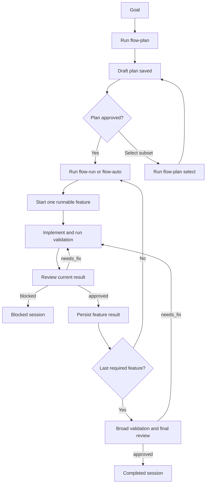

# Flow Plugin For OpenCode

`opencode-plugin-flow` adds a durable planning and execution workflow to OpenCode.

It turns a goal into a tracked session, breaks that goal into features, executes one feature at a time, and requires validation and reviewer approval before work can advance.

## What Flow Does

Flow provides:

- planning with a persisted draft plan
- explicit plan approval and feature selection
- single-feature execution with validation evidence
- reviewer-gated completion for each feature
- broad final validation before session completion
- autonomous plan, run, review, and replan loops
- structured recovery metadata for retryable runtime failures
- durable session state in `.flow/session.json`
- readable derived docs in `.flow/docs/`

## Workflow



## Commands

Flow injects these slash commands into OpenCode:

| Command | Purpose |
| --- | --- |
| `/flow-plan <goal>` | Create or refresh a draft plan for a goal |
| `/flow-plan select <feature-id...>` | Keep only the listed features in the current draft |
| `/flow-plan approve [feature-id...]` | Approve the current draft plan, optionally keeping only listed features |
| `/flow-run [feature-id]` | Execute exactly one approved feature |
| `/flow-auto <goal>` | Plan and execute autonomously from a new goal |
| `/flow-auto resume` | Resume the active autonomous session |
| `/flow-status` | Show the current session summary |
| `/flow-reset feature <id>` | Reset a feature and dependent features back to pending |
| `/flow-reset session` | Clear the active session |

## Quick Start

Typical manual flow:

1. `/flow-plan Add a workflow plugin for OpenCode`
2. Review the proposed features
3. `/flow-plan approve`
4. `/flow-run`
5. Repeat `/flow-run` until complete
6. `/flow-status`

Autonomous flow:

1. `/flow-auto Add a workflow plugin for OpenCode`
2. Let Flow plan, execute, validate, review, fix, and continue until complete or blocked
3. `/flow-status` at any point to inspect state

## Execution Guarantees

Flow is intentionally strict.

For a feature to complete successfully, the runtime requires:

- an approved plan
- exactly one active feature
- recorded validation evidence
- fully passing validation for that completion path
- a recorded reviewer decision
- an approved reviewer decision for the current scope
- a passing `featureReview`

For final session completion, Flow also requires:

- broad validation for the repo, not just targeted validation
- a final reviewer decision recorded through the runtime
- a passing `finalReview`

This is the main design choice in the plugin: review is not just advice in chat. It is a persisted gate in workflow state.

## Recovery Model

Retryable runtime failures can include structured recovery metadata alongside the error summary.

That metadata can include:

- `errorCode`
- `resolutionHint`
- `recoveryStage`
- `prerequisite`
- optional `requiredArtifact`
- `nextCommand`
- optional `nextRuntimeTool`
- optional `nextRuntimeArgs`

The runtime uses this to distinguish between missing prerequisites and immediately executable actions.

Examples:

- missing reviewer approval reports a `reviewer_result_required` prerequisite and the missing reviewer-decision artifact
- missing validation scope or evidence reports `validation_rerun_required`
- missing final review payload reports `completion_payload_rebuild_required`
- failing review or validation can point directly to `flow_reset_feature` when reset is the correct executable next step

`nextCommand` is always user-facing slash-command guidance. `nextRuntimeTool` only appears when the runtime can safely recommend an immediately executable tool action.

## Runtime State

Flow keeps one active session per worktree.

Authoritative state:

```text
.flow/session.json
```

Derived docs:

```text
.flow/docs/index.md
.flow/docs/features/<feature-id>.md
```

`session.json` is the source of truth. The markdown docs are projections of that state for easier inspection.

The session model includes:

- goal and lifecycle status
- plan approval state
- planning context and implementation approach
- ordered features with dependency metadata
- active feature and execution history
- validation evidence
- reviewer decisions
- notes, artifacts, and timestamps

## Architecture

The plugin is built around a small set of responsibilities:

1. A plugin `config` hook injects commands and agents.
2. Runtime tools own all state transitions.
3. Session state is stored in `.flow/session.json`.
4. Prompted agents call those tools instead of mutating state directly.
5. Derived markdown docs are rendered from saved session state.

Current injected agents:

- `flow-planner`
- `flow-worker`
- `flow-auto`
- `flow-reviewer`
- `flow-control`

Current runtime tools:

- `flow_status`
- `flow_plan_start`
- `flow_plan_apply`
- `flow_plan_approve`
- `flow_plan_select_features`
- `flow_run_start`
- `flow_run_complete_feature`
- `flow_review_record_feature`
- `flow_review_record_final`
- `flow_reset_feature`
- `flow_reset_session`

## Agent Roles

`flow-planner`

- reads the repo and creates a compact execution-ready plan
- does not write code
- does not write `.flow` files directly

`flow-worker`

- executes exactly one approved feature
- runs validation
- iterates on fixes when review finds issues
- persists completion only through runtime tools

`flow-reviewer`

- reviews feature-level or final cross-feature state
- returns `approved`, `needs_fix`, or `blocked`
- does not write code

`flow-auto`

- orchestrates planning, approval, execution, validation, review, fixing, and replanning
- keeps looping until completion or a real blocker
- treats runtime contract errors, completion-gating failures, and failing validation as recovery work when they are internally solvable
- uses repo evidence first and external research when useful to choose the next repair step before resetting and rerunning blocked features
- satisfies structured recovery prerequisites before taking the next runtime action

`flow-control`

- handles status and reset requests only

## Install

### Local development plugin

Build the plugin:

```bash
bun install
bun run build
```

OpenCode should load the built entrypoint:

```text
dist/index.js
```

Place that built file in an OpenCode plugin directory such as:

```text
.opencode/plugins/
```

or:

```text
~/.config/opencode/plugins/
```

Example:

```bash
cp dist/index.js .opencode/plugins/flow.js
```

For local development you can also symlink the built file.

### Package-based install

This repo is structured like an npm-style plugin package. After publishing, it can be added to `opencode.json`:

```json
{
  "plugin": ["opencode-plugin-flow"]
}
```

## Development

Install dependencies and run the full local check:

```bash
bun install
bun run check
```

Useful scripts:

- `bun run build`
- `bun run test`
- `bun run typecheck`
- `bun run check`

Key source files:

- `src/index.ts`: plugin entrypoint
- `src/config.ts`: command and agent injection
- `src/tools.ts`: runtime tool surface
- `src/runtime/schema.ts`: session and contract schemas
- `src/runtime/transitions.ts`: state transition rules
- `src/runtime/session.ts`: load and save helpers
- `src/runtime/render.ts`: derived markdown rendering
- `src/prompts/agents.ts`: agent instructions
- `src/prompts/commands.ts`: slash command templates

## Tool Schema Note

OpenCode plugin tools expect `args` to be provided as a raw Zod shape, not a top-level schema object.

Example:

```ts
const FlowRunStartArgsShape = {
  featureId: z.string().optional(),
};
```

This plugin uses two validation layers:

- SDK-facing tool `args` stay as raw shapes for OpenCode compatibility
- stricter runtime validation happens later through schemas such as `WorkerResultSchema`

Runtime transition failures can also carry structured recovery metadata so agents can tell the difference between:

- a missing prerequisite
- a missing artifact
- a valid user-facing next command
- an immediately executable runtime action

## Testing

The test suite currently covers:

- command and agent injection
- tool argument shape compatibility
- session creation, save, and load
- markdown doc rendering
- plan application, selection, and approval
- feature execution and reviewer gating
- blocked and replan-required outcomes
- final-review completion rules
- reset behavior
- prerequisite-aware recovery metadata and autonomous recovery behavior

Run tests with:

```bash
bun test
```
