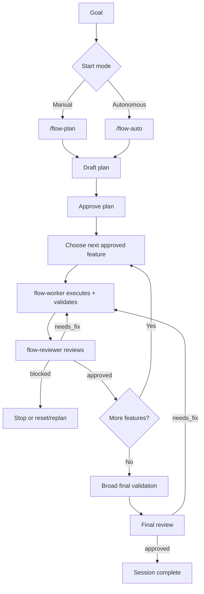

# Flow Plugin for OpenCode

`opencode-plugin-flow` adds a strict planning-and-execution workflow to OpenCode.

Flow turns a goal into a tracked session, breaks the work into features, executes one feature at a time, and requires validation plus reviewer approval before work can advance.

## What Flow Is Good For

Use Flow when you want:

- a durable session stored in `.flow/`
- a reviewed plan before execution
- one-feature-at-a-time execution
- validation evidence before completion
- reviewer-gated progression
- broad final validation before the whole session finishes

## Install

Choose one install path:

### Local repo

```bash
bun install
bun run install:opencode
```

### Latest GitHub release

```bash
curl -fsSL https://github.com/ddv1982/flow-opencode/releases/latest/download/install.sh | bash
```

Both install the plugin to:

```text
~/.opencode/plugins/flow.js
```

### Uninstall

From the repo:

```bash
bun run uninstall:opencode
```

From the latest GitHub release:

```bash
curl -fsSL https://github.com/ddv1982/flow-opencode/releases/latest/download/uninstall.sh | bash
```

### Manual fallback

If you ever need to copy the file yourself, build first and then copy `dist/index.js` into one of OpenCode's documented local plugin directories:

- `.opencode/plugins/`

## Quick Start

### Manual flow

1. `/flow-plan Add a workflow plugin for OpenCode`
2. Review the proposed features
3. `/flow-plan approve`
4. `/flow-run`
5. Repeat `/flow-run` until complete
6. `/flow-status`

### Autonomous flow

1. `/flow-auto Add a workflow plugin for OpenCode`
2. Let Flow plan, execute, validate, review, and continue until complete or blocked
3. Use `/flow-status` at any time to inspect progress

### Resume behavior

- `/flow-auto` with no argument is resume-only
- `/flow-auto resume` is the explicit equivalent
- if no active session exists, Flow asks for a goal
- completed sessions are not resumable

## Commands

Flow adds these slash commands to OpenCode:

| Command | Purpose |
| --- | --- |
| `/flow-plan <goal>` | Create or refresh a draft plan |
| `/flow-plan select <feature-id...>` | Keep only selected features in the draft |
| `/flow-plan approve [feature-id...]` | Approve the current draft plan |
| `/flow-run [feature-id]` | Execute exactly one approved feature |
| `/flow-auto <goal>` | Plan and execute autonomously from a new goal |
| `/flow-auto resume` | Resume the active autonomous session |
| `/flow-status` | Show the current session summary |
| `/flow-history` | Show stored session history |
| `/flow-session activate <id>` | Switch the active session |
| `/flow-reset feature <id>` | Reset a feature and dependents back to pending |
| `/flow-reset session` | Archive the active session and clear it |

## How Flow Works



## Storage

Flow keeps one active session per worktree.

Main session state:

```text
.flow/active
.flow/sessions/<session-id>/session.json
```

Readable docs:

```text
.flow/sessions/<session-id>/docs/index.md
.flow/sessions/<session-id>/docs/features/<feature-id>.md
```

Archived sessions live under:

```text
.flow/archive/
```

## Completion gates

Flow is intentionally strict.

Flow will not mark a feature complete unless it has:

- an approved plan
- exactly one active feature
- recorded validation evidence
- passing validation for that completion path
- a recorded reviewer decision
- an approved reviewer decision for the current scope
- a passing `featureReview`

Flow will not mark the whole session complete unless it also has:

- broad validation for the repo
- a final reviewer decision
- a passing `finalReview`

## Contributing

If you want to work on the plugin itself, see the [Development Guide](docs/development.md).

## License

This project is licensed under the MIT License. See `LICENSE` for the full text.
