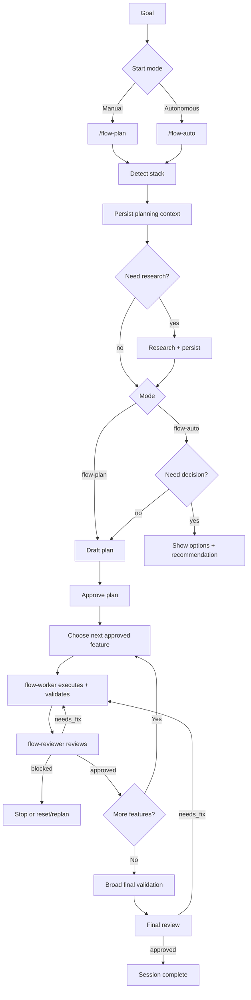

# Flow Plugin for OpenCode

`opencode-plugin-flow` adds a strict planning-and-execution workflow to OpenCode.

Flow turns a goal into a tracked session, breaks the work into features, executes one feature at a time, and requires validation plus reviewer approval before work can advance.

## What Flow Is Good For

Use Flow when you want:

- a durable session stored in `.flow/`
- a reviewed plan before execution
- one-feature-at-a-time execution
- validation evidence before completion
- reviewer-gated progression
- broad final validation before the whole session finishes

## Install

Choose one install path:

### Local repo

```bash
bun install
bun run install:opencode
```

### Latest GitHub release

```bash
curl -fsSL https://github.com/ddv1982/flow-opencode/releases/latest/download/install.sh | bash
```

By default, both install flows place the plugin at:

```text
~/.config/opencode/plugins/flow.js
```

### Uninstall

From the repo:

```bash
bun run uninstall:opencode
```

From the latest GitHub release:

```bash
curl -fsSL https://github.com/ddv1982/flow-opencode/releases/latest/download/uninstall.sh | bash
```

### Manual fallback

If you ever need to copy the file yourself, build first and then copy `dist/index.js` into one of OpenCode's documented local plugin directories:

- `~/.config/opencode/plugins/`

## Migration / Upgrade

Flow is now canonical-only.

- Installs go to `~/.config/opencode/plugins/flow.js`
- Uninstall removes Flow from `~/.config/opencode/plugins/flow.js`
- Legacy installs at `~/.opencode/plugins/flow.js` are no longer managed automatically
- Legacy `.flow/session.json` state is no longer auto-migrated into the current session-history layout

If you are upgrading from an older release:

1. Reinstall Flow to the canonical path:

   ```bash
   bun run install:opencode
   ```

   or

   ```bash
   curl -fsSL https://github.com/ddv1982/flow-opencode/releases/latest/download/install.sh | bash
   ```

2. If you still have a plugin at `~/.opencode/plugins/flow.js`, remove it manually.
3. If you still have old `.flow/session.json` workspace state, treat it as deprecated state and start from the current `.flow/sessions/<session-id>/session.json` layout.

## Quick Start

### Manual flow

1. `/flow-plan Add a workflow plugin for OpenCode`
2. Review the proposed features
3. `/flow-plan approve`
4. `/flow-run`
5. Repeat `/flow-run` until complete
6. `/flow-status`

### Autonomous flow

1. `/flow-auto Add a workflow plugin for OpenCode`
2. Let Flow detect the stack, persist planning context, research when needed, then plan, execute, validate, review, and continue until complete or blocked
3. Use `/flow-status` at any time to inspect progress

### Resume behavior

- `/flow-auto` with no argument is resume-only
- `/flow-auto resume` is the explicit equivalent
- if no active session exists, Flow asks for a goal
- completed sessions are not resumable

## Commands

Flow adds these slash commands to OpenCode:

| Command | Purpose |
| --- | --- |
| `/flow-plan <goal>` | Create or refresh a draft plan |
| `/flow-plan select <feature-id...>` | Keep only selected features in the draft |
| `/flow-plan approve [feature-id...]` | Approve the current draft plan |
| `/flow-run [feature-id]` | Execute exactly one approved feature |
| `/flow-auto <goal>` | Plan and execute autonomously from a new goal |
| `/flow-auto resume` | Resume the active autonomous session |
| `/flow-status` | Show the current session summary |
| `/flow-history` | Show stored session history |
| `/flow-history show <session-id>` | Show a specific stored session |
| `/flow-session activate <id>` | Switch the active session |
| `/flow-reset feature <id>` | Reset a feature and dependents back to pending |
| `/flow-reset session` | Archive the active session and clear it |

## How Flow Works

Before Flow drafts or refreshes a plan, it first inspects repo evidence to detect the stack and persist planning context such as repo profile, research notes, implementation approach, and any recorded decision notes.

Flow researches only when local repo evidence is insufficient to produce a high-confidence plan or recommendation, or when external grounding would materially improve a meaningful technical decision.

`/flow-plan` uses that context to draft a plan, but it does not hard-stop on decision gates. `/flow-auto` uses the same context, and if a meaningful decision still remains after repo evidence and research, it pauses with options, tradeoffs, and a recommended path before continuing.



## Storage

Flow keeps one active session per worktree.

Main session state:

```text
.flow/active
.flow/sessions/<session-id>/session.json
```

Readable docs:

```text
.flow/sessions/<session-id>/docs/index.md
.flow/sessions/<session-id>/docs/features/<feature-id>.md
```

Archived sessions live under:

```text
.flow/archive/
```

## Completion gates

Flow is intentionally strict.

Flow will not mark a feature complete unless it has:

- an approved plan
- exactly one active feature
- recorded validation evidence
- passing validation for that completion path
- a recorded reviewer decision
- an approved reviewer decision for the current scope
- a passing `featureReview`

Flow will not mark the whole session complete unless it also has:

- broad validation for the repo
- a final reviewer decision
- a passing `finalReview`

See [CHANGELOG.md](CHANGELOG.md) for release notes.

## Contributing

If you want to work on the plugin itself, see the [Development Guide](docs/development.md).

## License

This project is licensed under the MIT License. See `LICENSE` for the full text.
