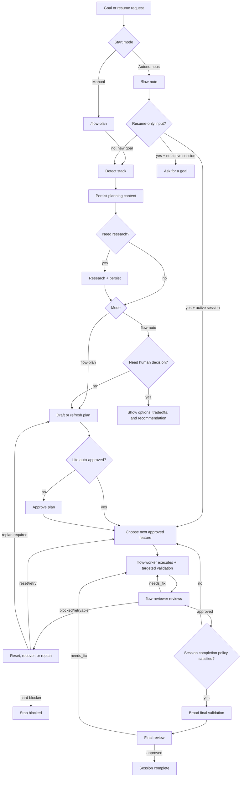

# Flow Plugin for OpenCode

`opencode-plugin-flow` adds a strict planning-and-execution workflow to OpenCode.

Flow turns a goal into a tracked session, breaks the work into features, executes one feature at a time, and requires validation plus reviewer approval before work can advance.

## What Flow Is Good For

Use Flow when you want:

- a durable session stored in `.flow/`
- a reviewed plan before execution
- one-feature-at-a-time execution
- validation evidence before completion
- reviewer-gated progression
- broad final validation before the whole session finishes

## Install

Choose one install path:

### Local repo

```bash
bun install
bun run install:opencode
```

### Latest GitHub release

```bash
curl -fsSL https://github.com/ddv1982/flow-opencode/releases/latest/download/install.sh | bash
```

By default, both install flows place the plugin at:

```text
~/.config/opencode/plugins/flow.js
```

### Uninstall

From the repo:

```bash
bun run uninstall:opencode
```

From the latest GitHub release:

```bash
curl -fsSL https://github.com/ddv1982/flow-opencode/releases/latest/download/uninstall.sh | bash
```

### Manual fallback

If you ever need to copy the file yourself, build first and then copy `dist/index.js` into one of OpenCode's documented local plugin directories:

- `~/.config/opencode/plugins/`

## Migration / Upgrade

Flow is now canonical-only.

- Installs go to `~/.config/opencode/plugins/flow.js`
- Uninstall removes Flow from `~/.config/opencode/plugins/flow.js`
- Legacy installs at `~/.opencode/plugins/flow.js` are no longer managed automatically
- Legacy `.flow/session.json` state is no longer auto-migrated into the current session-history layout

If you are upgrading from an older release:

1. Reinstall Flow to the canonical path:

   ```bash
   bun run install:opencode
   ```

   or

   ```bash
   curl -fsSL https://github.com/ddv1982/flow-opencode/releases/latest/download/install.sh | bash
   ```

2. If you still have a plugin at `~/.opencode/plugins/flow.js`, remove it manually.
3. If you still have old `.flow/session.json` workspace state, treat it as deprecated state and start from the current `.flow/active/<session-id>/`, `.flow/stored/<session-id>/`, and `.flow/completed/<session-id>-<timestamp>/` layout.

## Quick Start

### Manual flow

1. `/flow-plan Add a workflow plugin for OpenCode`
2. Review the proposed features
3. `/flow-plan approve` if Flow did not already auto-approve a safe lite draft
4. `/flow-run`
5. Repeat `/flow-run` until complete
6. `/flow-status`

### Autonomous flow

1. `/flow-auto Add a workflow plugin for OpenCode`
2. Let Flow detect the stack, persist planning context, research when needed, then plan, execute, validate, review, and continue until complete or blocked
3. Use `/flow-status` at any time to inspect progress
4. Use `/flow-status detail` if you want the fuller structured view

### Resume behavior

- `/flow-auto` with no argument is resume-only
- `/flow-auto resume` is the explicit equivalent
- if no active session exists, Flow asks for a goal
- completed sessions are not resumable

### Readiness check

Run `/flow-doctor` when you want a non-destructive readiness check for:

- canonical install health
- command/agent injection health
- workspace writability and whether Flow trusts the resolved workspace root for mutation
- active session artifact health
- the current blocker and recommended next step

Flow treats the resolved project/worktree as a hard boundary for session writes. By default it refuses to mutate session state in suspicious roots such as `~`, `~/.config/...`, or `~/.factory/...`. If you intentionally need a nonstandard root, allowlist the exact absolute path with `FLOW_TRUSTED_WORKSPACE_ROOTS`. This variable accepts one or more exact absolute paths separated by your platform path delimiter (`:` on macOS/Linux, `;` on Windows).

Use `/flow-doctor detail` if you want the fuller structured view.

### What `/flow-status` and `/flow-doctor` show

Both commands are designed to be easy to scan.

- they lead with the current situation in plain language
- they surface the current phase and the selected Flow lane (`lite`, `standard`, or `strict`)
- they tell you why Flow chose that lane and what blocker, if any, is active
- they tell you the next recommended step
- they show the most relevant next command to run
- they still include structured details underneath for deeper inspection

That same operator model is now used beyond `/flow-status` and `/flow-doctor`; resumability and session inspection surfaces such as `/flow-history show` and `/flow-auto` preparation responses also expose phase/lane/blocker/reason fields.

In the **lite** lane, Flow can auto-approve a safe single-feature draft plan so small tasks can move directly into execution without a separate approval hop.
In the **lite** lane, Flow can also accept an in-band passing review payload during completion, so tiny tasks do not always need a separate persisted reviewer-decision step before finishing.
In the **lite** lane, retryable non-human execution failures can return the feature directly to `ready`/`pending`, avoiding a separate manual reset step before rerunning.

## Commands

Flow adds these slash commands to OpenCode:

| Command | Purpose |
| --- | --- |
| `/flow-plan <goal>` | Create or refresh a draft plan |
| `/flow-plan select <feature-id...>` | Keep only selected features in the draft |
| `/flow-plan approve [feature-id...]` | Approve the current draft plan |
| `/flow-run [feature-id]` | Execute exactly one approved feature |
| `/flow-auto <goal>` | Plan and execute autonomously from a new goal |
| `/flow-auto resume` | Resume the active autonomous session |
| `/flow-status [detail]` | Show the current session summary; default is compact, `detail` shows the fuller structured view |
| `/flow-doctor [detail]` | Run non-destructive Flow readiness checks; default is compact, `detail` shows the fuller structured view |
| `/flow-history` | Show active, stored, and completed session history |
| `/flow-history show <session-id>` | Show a specific active, stored, or completed session |
| `/flow-session activate <id>` | Switch the active session |
| `/flow-session close <completed|deferred|abandoned>` | Close the active session with an explicit outcome |
| `/flow-reset feature <id>` | Reset a feature and dependents back to pending |

## How Flow Works

Before Flow drafts or refreshes a plan, it first inspects repo evidence to detect the stack and persist planning context such as repo profile, research notes, implementation approach, recorded decision notes, and replan history.

Flow researches only when local repo evidence is insufficient to produce a high-confidence plan or recommendation, or when external grounding would materially improve a meaningful technical decision.

`/flow-plan` uses that context to draft a plan, but it does not hard-stop on decision gates. `/flow-auto` uses the same context, and if a meaningful decision still remains after repo evidence and research, it records the decision as one of:

- `autonomous_choice` — Flow may continue on its own
- `recommend_confirm` — Flow presents a recommendation and pauses for confirmation
- `human_required` — Flow must stop for a human decision

That decision is surfaced back through the runtime session summary as a `decisionGate`, so autonomous continuation can key off runtime state instead of only prompt wording.

Plans can also carry an explicit delivery policy so Flow knows whether it should ship only when everything is clean, ship when core work is done, or ship when a declared threshold is met.



## Storage

Flow keeps one active session per worktree and writes session state only inside the intended project/worktree root.

Read-only inspection commands such as `/flow-status`, `/flow-history`, and `/flow-doctor` can still report what Flow sees, but mutating commands refuse suspicious roots unless the exact absolute path is trusted with `FLOW_TRUSTED_WORKSPACE_ROOTS` (single path or path-delimited list of exact roots).

Main session state:

```text
.flow/active/<session-id>/session.json
.flow/stored/<session-id>/session.json
```

Readable docs:

```text
.flow/active/<session-id>/docs/index.md
.flow/active/<session-id>/docs/features/<feature-id>.md
```

Closed session history lives under:

```text
.flow/completed/
```

Completed history can contain different closure outcomes in session metadata:

- `completed`
- `deferred`
- `abandoned`

## Completion gates

Flow is intentionally strict.

Flow will not mark a feature complete unless it has:

- an approved plan
- exactly one active feature
- recorded validation evidence
- passing validation for that completion path
- a passing `featureReview`

In standard and strict flows, Flow also requires a recorded reviewer decision for the current scope.

In the lite lane, Flow can accept an in-band passing review payload during completion, so tiny tasks do not always need a separately persisted reviewer decision before the feature finishes.

Flow will not mark the whole session complete unless it also has:

- broad validation for the repo
- a passing `finalReview`

In standard and strict flows, Flow also requires a recorded final reviewer decision.

In the lite lane, Flow can accept an in-band passing final review payload when the completion path already carries the required broad validation and final review evidence.

See [CHANGELOG.md](CHANGELOG.md) for release notes.

## Contributing

If you want to work on the plugin itself, see the [Development Guide](docs/development.md).

## License

This project is licensed under the MIT License. See `LICENSE` for the full text.
