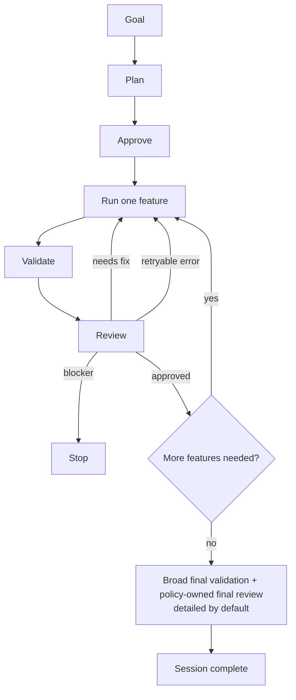

# Flow Plugin for OpenCode

`opencode-plugin-flow` adds a stateful planning-and-execution workflow to OpenCode. It is designed for work that should be planned, validated, reviewed, and resumable rather than handled as a disposable one-shot prompt.

## What Flow does

- Turns a goal into a **tracked session** with a visible plan.
- Executes **one feature at a time** instead of changing many things at once.
- Records **validation evidence** and **review approvals** before it advances.
- Lets you **resume** work later from on-disk session state.
- Adapts automatically: small work stays light, larger work gets more structure and gating.

## When to use it

Use Flow when you want:

- a visible plan before code changes happen
- one feature at a time, with validation evidence recorded
- reviewer-gated progression for bigger work
- resumable session state you can come back to

## When to skip it

Flow is the wrong fit when you want:

- a disposable one-off prompt with zero workflow overhead
- loosely structured brainstorming
- experiments you do not want persisted on disk

## Install

### From this repo

```bash
bun install
bun run install:opencode
```

### From the latest GitHub release

```bash
curl -fsSL https://github.com/ddv1982/flow-opencode/releases/latest/download/install.sh | bash
```

Both install paths place the plugin at:

```text
~/.config/opencode/plugins/flow.js
```

The source-install path for this plugin repo is Bun-based. That does **not** mean Flow expects Bun in the project you point it at.

### Uninstall

From the repo:

```bash
bun run uninstall:opencode
```

From the latest release:

```bash
curl -fsSL https://github.com/ddv1982/flow-opencode/releases/latest/download/uninstall.sh | bash
```

## Quick Start

### Most people start with one of these

```text
/flow-auto Add a workflow plugin for OpenCode
```

```text
/flow-plan Add a workflow plugin for OpenCode
```

```text
/flow-review Review this repository for correctness and release risks
```

- Use **`/flow-auto`** when you want Flow to drive the work end to end.
- Use **`/flow-plan`** when you want to inspect or shape the plan before execution.
- Use **`/flow-review`** when you want a read-only findings report instead of code changes.

### `/flow-auto` (recommended)

Flow will inspect the repo, draft a plan, execute one feature at a time, validate, review, and continue until the work is done or something genuinely blocks it.

For small tasks, this can finish in a single pass. For larger work, Flow adds the extra planning, validation, and review gates it needs.

Flow treats the target repo's existing `package.json` scripts as the primary execution contract. Package-manager detection (`npm`, `pnpm`, `yarn`, `bun`) is supporting evidence, not a guessing engine.

In monorepos, Flow starts from the current working subdirectory and walks upward to the Flow workspace root, so package-local lockfiles or `package.json#packageManager` entries can override root-level defaults.

If one directory contains conflicting lockfile families and there is no explicit `package.json#packageManager`, Flow treats that evidence as ambiguous instead of guessing. In that case it prefers existing `package.json` scripts and surfaces the ambiguity in planning context.

### Manual, step by step

1. `/flow-plan Add a workflow plugin for OpenCode`
   - narrow a draft with `/flow-plan select <feature-id>...`
   - approve the current draft with `/flow-plan approve [feature-id]...`
2. Review the proposed features
3. `/flow-plan approve` (Flow may already have auto-approved a safe small plan)
4. `/flow-run` to execute exactly one approved feature
5. Repeat `/flow-run` until the session is complete
6. `/flow-status` at any point to see where you are

### Resume

- `/flow-auto` with no arguments resumes the active session
- `/flow-auto resume` is the explicit form
- If there's no active session, Flow asks for a goal instead of inventing one
- Completed sessions are not resumable — start a new one

### Review existing code (read-only)

Use `/flow-review` when you want a read-only findings report instead of feature execution.

```text
/flow-review Review this repository for correctness and release risks
```

By default, `/flow-review` returns a human-readable report with:

- Conclusion
- Top findings
- Recommended next actions
- Coverage notes

Review depth options:

- `default` — broad review across the major repo surfaces
- `detailed` — deeper review with direct evidence across the major repo surfaces
- `exhaustive` — highest review strength; only claimed when coverage actually supports it

Examples:

```text
/flow-review detailed Review this repository for correctness, integration risks, and release issues
/flow-review detailed Review this codebase for architectural issues, test gaps, and likely regressions
/flow-review exhaustive Review this repository before release and identify all major risks
```

Flow will only claim the strongest achieved review depth when the inspected coverage actually supports it.

## The commands most people use

- Start or reshape work → `/flow-plan <goal>`
- Run one approved feature → `/flow-run [feature-id]`
- Run autonomously end to end → `/flow-auto <goal>` or `/flow-auto resume`
- Run a read-only repo review → `/flow-review <goal>`
- See what Flow is doing and what to run next → `/flow-status [detail]`
- Diagnose readiness or blockers → `/flow-doctor [detail]`
- Browse sessions → `/flow-history` / `/flow-history show <session-id>`
- Switch or close the active session → `/flow-session activate <id>` / `/flow-session close <completed|deferred|abandoned>`
- Reset a feature → `/flow-reset feature <id>`

## How Flow works

At a high level, Flow does this:

1. **Inspect** the repo for evidence.
2. **Plan** the work into one or more features.
3. **Execute** one feature at a time.
4. **Validate** the result with recorded evidence.
5. **Review** the result before advancing.
6. **Continue, recover, or replan** until the session is complete. Final completion uses broad final validation plus the runtime-owned final review policy (currently a detailed cross-feature review by default).

> Note: Runtime-level parallel feature execution is intentionally deferred; Flow continues to execute one feature at a time.


```mermaid
flowchart TD
    A[Goal] --> B[Plan]
    B --> C[Approve]
    C --> D[Run one feature]
    D --> E[Validate]
    E --> F[Review]
    F -->|needs fix| D
    F -->|retryable error| D
    F -->|blocker| X[Stop]
    F -->|approved| G{More features needed?}
    G -->|yes| D
    G -->|no| H[Broad final validation + policy-owned final review<br/>detailed by default]
    H --> I[Session complete]
```

## Session state on disk

Flow writes state only inside the worktree it's running in:

```text
.flow/active/<session-id>/session.json
.flow/stored/<session-id>/session.json
.flow/completed/<session-id>-<timestamp>/
```

Readable markdown for each session lives alongside it:

```text
.flow/active/<session-id>/docs/index.md
.flow/active/<session-id>/docs/features/<feature-id>.md
```

Read-only `/flow-review` reports are returned directly to the caller. Flow does not maintain a separate persisted review-history tree.

There is exactly one active session per worktree. Switching with `/flow-session activate <id>` moves the current active session to `stored/` and brings the requested one in.

### Workspace safety

Flow refuses to write session state in your home directory itself (`$HOME`) or at filesystem roots.

If the effective mutable workspace root is a hidden directory other than `.flow` (for example `~/.factory`), Flow asks for approval before it writes its own `.flow/**` state there. That approval can be granted once or remembered by OpenCode for the rest of the session.

If the normal project/worktree root is in use, hidden directories that merely exist inside the project do not change where Flow writes state: it still uses the workspace-local `.flow/**` subtree at the root.

## Readiness check

Run `/flow-doctor` when something looks off. It reports:

- plugin install health at `~/.config/opencode/plugins/flow.js`
- command and agent injection health
- workspace writability and whether the current root is trusted
- active session artifact health
- the current blocker and the recommended next step

Use `/flow-doctor detail` for the fuller structured view.

## Upgrading

If you're coming from an older release that installed under `~/.opencode/plugins/` or used a flat `.flow/session.json`, see [`docs/migration/`](docs/migration/) for the steps. Legacy paths are no longer auto-migrated.

Release notes live in [`CHANGELOG.md`](CHANGELOG.md).

## Package API boundary (for consumers)

`opencode-plugin-flow` supports **root-only imports**. Treat only the package root as public API:

```ts
import flowPlugin from "opencode-plugin-flow";
```

Deep imports (for example `opencode-plugin-flow/dist/...` or `opencode-plugin-flow/src/...`) are intentionally not exported and are outside compatibility guarantees.

Compatibility implications:

- patch/minor updates may freely move or remove internal files
- only root entrypoint behavior is part of semver compatibility
- if you currently deep-import internals, migrate to the root plugin entrypoint

## Contributing

Working on the plugin itself? See the [Development Guide](docs/development.md).

Prompt behavior is treated as a tested product surface. The maintainer workflow includes providerless prompt captures and behavior evals for review, planning, execution, control, and auto-resume modes, so prompt changes can be checked without calling a model API or requiring an API key.

## License

MIT. See [`LICENSE`](LICENSE) for the full text.
