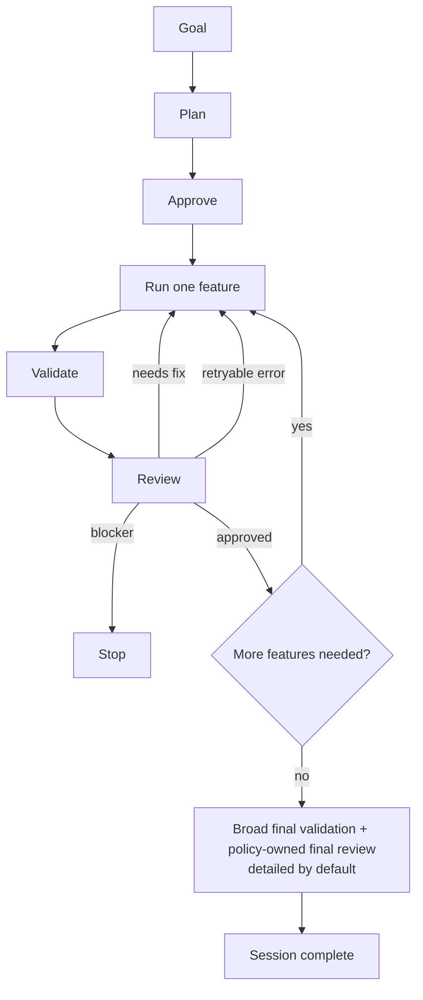

# Flow Plugin for OpenCode

`opencode-plugin-flow` adds a stateful planning-and-execution workflow to OpenCode. It is designed for work that should be planned, validated, reviewed, and resumable rather than handled as a disposable one-shot prompt.

## The short version

If you just want Flow to handle a task:

1. Install the plugin.
2. Open OpenCode in the project you want to change.
3. Run `/flow-auto <your goal>`.
4. Use `/flow-status` if you want to inspect progress.

Flow will plan, run, validate, review, and resume the work using workspace-local `.flow/**` state.

## What Flow does

- Turns a goal into a **tracked session** with a visible plan.
- Executes **one feature at a time** instead of changing many things at once.
- Records **validation evidence** and **review approvals** before it advances.
- Records a runtime-owned **stack and standards profile** so planning can prefer local repo guidance before external assumptions.
- Lets you **resume** work later from on-disk session state.
- Adapts automatically: small work stays light, larger work gets more structure and gating.

## When to use it

Use Flow when you want:

- a visible plan before code changes happen
- one feature at a time, with validation evidence recorded
- reviewer-gated progression for bigger work
- resumable session state you can come back to

## When to skip it

Flow is the wrong fit when you want:

- a disposable one-off prompt with zero workflow overhead
- loosely structured brainstorming
- experiments you do not want persisted on disk

## Install

### From this repo

```bash
bun install
bun run install:opencode
```

### From the latest GitHub release

```bash
curl -fsSL https://github.com/ddv1982/flow-opencode/releases/latest/download/install.sh | bash
```

The release installer installs both the global OpenCode plugin and Flow's global guidance skills.

Both install paths install global OpenCode assets only.

The plugin is installed globally for OpenCode:

```text
~/.config/opencode/plugins/flow.js
```

The guidance skills are installed globally for OpenCode:

```text
~/.config/opencode/skills/flow-plan/SKILL.md
~/.config/opencode/skills/flow-run/SKILL.md
~/.config/opencode/skills/flow-review/SKILL.md
```

You still start Flow with the slash commands below. The skills give OpenCode on-demand guidance for planning, running, and reviewing work; they do not replace the plugin or create separate workflow state.

The source-install path for this plugin repo is Bun-based. That does **not** mean Flow expects Bun in the project you point it at.

### Uninstall

From the repo:

```bash
bun run uninstall:opencode
```

From the latest release:

```bash
curl -fsSL https://github.com/ddv1982/flow-opencode/releases/latest/download/uninstall.sh | bash
```

Uninstall clears the canonical global `flow.js` plugin slot, including stale or outdated Flow plugin files, and removes generated Flow skill files only if they are still Flow-owned. If you edited a generated skill by hand, Flow refuses to delete it silently.

## Quick Start

### Recommended: let Flow drive the work

```text
/flow-auto Add a workflow plugin for OpenCode
```

Use **`/flow-auto`** when you want Flow to drive the work end to end. It is the best default for most implementation tasks.

### Other common starts

```text
/flow-plan Add a workflow plugin for OpenCode
```

```text
/flow-review Review this repository for correctness and release risks
```

- Use **`/flow-plan`** when you want to inspect or shape the plan before execution.
- Use **`/flow-review`** when you want a read-only findings report instead of code changes.

OpenCode may also surface the installed `flow-plan`, `flow-run`, and `flow-review` skills when it needs more detailed guidance. You normally do not need to call those directly; use the slash commands.

### `/flow-auto` in practice

Flow will inspect the repo, draft a plan, execute one feature at a time, validate, review, and continue until the work is done or something genuinely blocks it.

For small tasks, this can finish in a single pass. For larger work, Flow adds the extra planning, validation, and review gates it needs.

Flow uses the target repo's existing scripts and local guidance as the execution contract. It records stack and standards evidence from files such as `package.json`, lockfiles, config files, `AGENTS.md`, and project docs. In monorepos, package-local evidence can override root-level defaults.

When OpenCode reports current/latest attachments through `/flow-auto` preparation, Flow follows `attachmentGuidance.materializationRequired`: if true, it materializes captured PNG, JPEG, WebP, GIF, or AVIF chat attachments into explicit workspace asset files before planning or delegating implementation. SVG, raw base64 payloads, filesystem paths, and HTTP URLs are not supported by this materialization tool. Chat attachments are not shell-readable project files until Flow imports them; imported assets are placed in normal project asset paths from the runtime guidance, not under `.flow/**`.

For broad review-and-fix goals, you can also select the read-only `flow-planning-researcher` agent in OpenCode, or let `/flow-plan` / `/flow-auto` hand off to it when planning needs evidence first. It gathers repository evidence and recommends a review-first plan; findings still come from `/flow-review` or persisted reviewer records, not from planning research.

### Manual, step by step

1. `/flow-plan Add a workflow plugin for OpenCode`
   - narrow a draft with `/flow-plan select <feature-id>...`
   - approve the current draft with `/flow-plan approve [feature-id]...`
2. Review the proposed features
3. `/flow-plan approve` (Flow may already have auto-approved a safe small plan)
4. `/flow-run` to execute exactly one approved feature
5. Repeat `/flow-run` until the session is complete
6. `/flow-status` at any point to see where you are

### Resume

- `/flow-auto` with no arguments resumes the active session
- `/flow-auto resume` is the explicit form
- If there's no active session, Flow asks for a goal instead of inventing one
- Completed sessions are not resumable — start a new one

### Review existing code (read-only)

Use `/flow-review` when you want a read-only findings report instead of feature execution.

```text
/flow-review Review this repository for correctness and release risks
```

By default, `/flow-review` returns a human-readable report with:

- Conclusion
- Top findings
- Recommended next actions
- Coverage notes

Review depth options:

- `default` — broad review across the major repo surfaces
- `detailed` — deeper review with direct evidence across the major repo surfaces
- `exhaustive` — highest review strength; only claimed when coverage actually supports it

Examples:

```text
/flow-review detailed Review this repository for correctness, integration risks, and release issues
/flow-review detailed Review this codebase for architectural issues, test gaps, and likely regressions
/flow-review exhaustive Review this repository before release and identify all major risks
```

Flow will only claim the strongest achieved review depth when the inspected coverage actually supports it. Changed files are the review starting point, not the full boundary: coverage may include connected callers, callees, tests, prompts, tooling, release surfaces, and validation evidence, but those claims must be grounded in actual files, relationships, and recorded validation commands.

`/flow-review` is intentionally read-only. To remediate findings under Flow's tracked gates, start or activate a Flow session for review-fix work and complete it through `/flow-run` / `/flow-auto`, recorded validation, reviewer approval, and final review when applicable.

## The commands most people use

- Start or reshape work → `/flow-plan <goal>`
- Run one approved feature → `/flow-run [feature-id]`
- Run autonomously end to end → `/flow-auto <goal>` or `/flow-auto resume`
- Run a read-only repo review → `/flow-review <goal>`
- See what Flow is doing and what to run next → `/flow-status [detail]`
- Diagnose readiness or blockers → `/flow-doctor [detail]`
- Browse sessions → `/flow-history` / `/flow-history show <session-id>`
- Switch or close the active session → `/flow-session activate <id>` / `/flow-session close <completed|deferred|abandoned>`
- Reset a feature → `/flow-reset feature <id>`

## How Flow works

Flow has four pieces:

- **Global OpenCode plugin** — adds Flow commands, agents, tools, and hooks to OpenCode.
- **Global OpenCode skills** — provide on-demand guidance for planning, running, and reviewing.
- **Slash commands** — the user-facing way to start or inspect Flow work.
- **`.flow/**` state** — the workspace-local session files Flow owns and updates.

At a high level, Flow does this:

1. **Inspect** the repo for evidence.
2. **Plan** the work into one or more features.
3. **Execute** one feature at a time.
4. **Validate** the result with recorded evidence.
5. **Review** the result before advancing.
6. **Continue, recover, or replan** until the session is complete. Final completion uses broad final validation plus the runtime-owned final review policy (currently a detailed cross-feature review by default), with evidence-backed coverage across changed artifacts, connected context, and validation results.

> Note: Runtime-level parallel feature execution is intentionally deferred; Flow continues to execute one feature at a time.


```mermaid
flowchart TD
    A[Goal] --> B[Plan]
    B --> C[Approve]
    C --> D[Run one feature]
    D --> E[Validate]
    E --> F[Review]
    F -->|needs fix| D
    F -->|retryable error| D
    F -->|blocker| X[Stop]
    F -->|approved| G{More features needed?}
    G -->|yes| D
    G -->|no| H[Broad final validation + policy-owned final review<br/>detailed by default]
    H --> I[Session complete]
```

## Where Flow stores state

Most users do not need to edit these files directly. They are useful when you want to inspect or back up Flow's workspace-local state.

Flow writes state only inside the worktree it's running in:

```text
.flow/active/<session-id>/session.json
.flow/active/<session-id>/docs/index.md
.flow/active/<session-id>/docs/features/<feature-id>.md
.flow/stored/<session-id>/session.json
.flow/completed/<session-id>-<timestamp>/session.json
.flow/locks/
.flow/standards-profile.json
```

Flow stores the canonical workflow state in session JSON files. Readable markdown for active sessions lives beside the saved active session and is regenerated from that state; removed event, checkpoint, and projection trees are not current storage locations.

Materialized attachment assets are user/project files, not Flow state. Flow does not store imported image assets under `.flow/**`; workers and reviewers cite the returned workspace-relative asset paths as artifacts or evidence after import.

`.flow/standards-profile.json` is a cache for planning context, not workflow state. Flow ignores it when the workspace, start directory, package-manager hint, schema version, source-file fingerprint, or external-guidance TTL no longer matches.

Read-only `/flow-review` reports are returned directly to the caller. Flow does not maintain a separate persisted review-history tree, and direct follow-up fixes outside Flow do not mutate session records.

There is exactly one active session per worktree. Switching with `/flow-session activate <id>` moves the current active session to `stored/` and brings the requested one in. Stored non-completed sessions are inactive saved sessions; activate one before continuing it.

### Workspace safety

Flow refuses to write session state in your home directory itself (`$HOME`) or at filesystem roots.

If the effective mutable workspace root is a hidden directory other than `.flow` (for example `~/.hidden-workspace`), Flow asks for approval before it writes its own `.flow/**` state there. That approval can be granted once or remembered by OpenCode for the rest of the session.

If the normal project/worktree root is in use, hidden directories that merely exist inside the project do not change where Flow writes state: it still uses the workspace-local `.flow/**` subtree at the root.

## Readiness check

Run `/flow-doctor` when something looks off. It reports:

- plugin install health at `~/.config/opencode/plugins/flow.js`
- command and agent injection health
- workspace writability and whether the current root is trusted
- active session artifact health
- the current blocker and the recommended next step

Use `/flow-doctor detail` for the fuller structured view.

## Releases

Release notes live in [`CHANGELOG.md`](CHANGELOG.md).

## Contributing

Working on the plugin itself? See the [Development Guide](docs/development.md).

For maintainers, [`docs/maintainer-contract.md`](docs/maintainer-contract.md) is the short non-historical contract map for current commands, tools, state paths, and high-risk checks. [`docs/contributor-map.md`](docs/contributor-map.md) maps risky areas to files and validation commands.

Prompt behavior is treated as a tested product surface. The maintainer workflow includes providerless prompt captures and behavior evals for review, planning, execution, control, and auto-resume modes, so prompt changes can be checked without calling a model API or requiring an API key.

### Package API boundary

`opencode-plugin-flow` supports **root-only imports**. Treat only the package root as public API:

```ts
import flowPlugin from "opencode-plugin-flow";
```

Deep imports (for example `opencode-plugin-flow/dist/...` or `opencode-plugin-flow/src/...`) are intentionally not exported and are outside the public API.

## License

MIT. See [`LICENSE`](LICENSE) for the full text.
