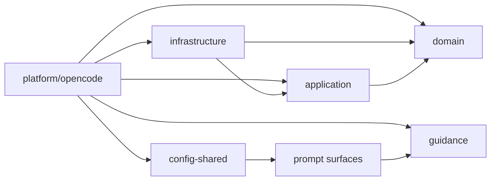

# Allowed cross-layer dependencies

Flow v6 uses inward-only source dependencies:

- `src/domain/**` owns Session v5 values, invariants, and pure transitions. It
  may use standard-library primitives but imports no application,
  infrastructure, platform, or host APIs.
- `src/application/**` owns use cases and ports. It imports domain only.
- `src/infrastructure/**` implements application ports for local persistence,
  workspace resolution, and source fingerprinting.
- `src/platform/opencode/**` owns OpenCode hooks, host schemas, validation
  observation, the project-scoped duplicate guard, and result rendering.
- The duplicate guard keeps only canonical project registrations and a compact
  reason status. It does not elect a leader or expose registered runtime
  identities through tool diagnostics.
- `src/guidance/**` and `skills/**` own workflow judgment embedded in the
  package.
- Prompt surfaces compile commands and the hidden worker and reviewer roles
  from concise guidance; they do not own lifecycle state.
- `src/index.ts` is the package entrypoint.

There is no runtime/adapters compatibility tree or activation/distribution
layer or Flow-owned CLI entrypoint. Architecture tests enforce dependency
direction and the absence of retired layers.
