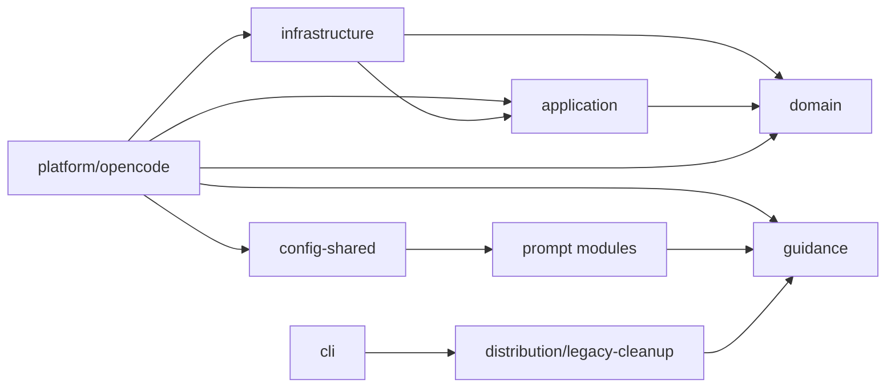

# Source Ownership

Flow v5 uses inward-only dependencies:

- `src/domain/**` owns values, invariants, state, and pure transitions. It may
  not import application, infrastructure, platform, distribution, or host APIs.
- `src/application/**` owns use cases and ports. It may import domain only.
- `src/infrastructure/**` implements application ports for local filesystems and
  process services. It may import application and domain.
- `src/platform/opencode/**` is the outer composition and transport layer. It
  may import the inward layers, config, and embedded guidance. Host-owned schemas
  stay private in this layer and never appear in emitted public types.
- `src/guidance/**` owns stable ids and Markdown embedded into the package.
- `src/distribution/**` owns only explicit, recoverable legacy cleanup. It is
  not imported by plugin startup and does not import workflow behavior.
- `src/prompt-*.ts` compiles host-neutral prompt fragments and evaluation
  contracts from bundled guidance definitions.
- `src/cli.ts` is a thin outer adapter over distribution APIs.
- `src/index.ts` is the ESM package entrypoint.

The removed `src/runtime/**` and `src/adapters/**` trees have no compatibility
entrypoints. `tests/architecture-boundaries.test.ts` enforces both their absence
and the inward dependency rules above.
