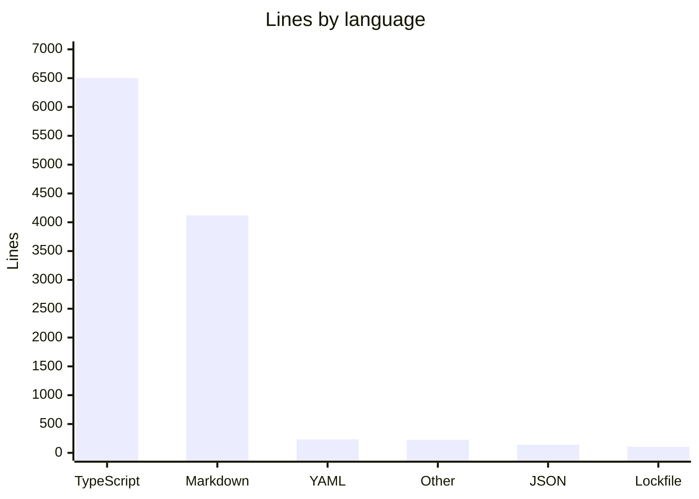

# By the numbers

Data collected on 2026-07-02 from `main` at `819182cab2da32253210ae6c09535f2901779304`.

## Size

The repository is small but test-heavy. Excluding `node_modules`, `dist`, `.git`, `.flow`, `.factory`, `.release-artifacts`, and `droid-wiki`, it contains 76 tracked or local project files.

| Category | Count |
| --- | ---: |
| TypeScript source files in `src/` | 18 |
| Test files in `tests/` | 5 |
| Config, workflow, and top-level metadata files | 12 |
| Markdown files | 38 |

## Directory size

| Directory | Files | Lines |
| --- | ---: | ---: |
| `src/` | 18 | 3,365 |
| `tests/` | 5 | 3,138 |
| `docs/` | 11 | 1,910 |
| `skills/` | 23 | 1,812 |
| `.github/` | 4 | 246 |

## Activity

Recent history is concentrated in the v4 rewrite and release hardening work.

| Month | Commits |
| --- | ---: |
| 2026-03 | 9 |
| 2026-04 | 199 |
| 2026-05 | 98 |
| 2026-06 | 68 |
| 2026-07 | 9 |

Top churn hotspots in the last 90 days include removed historical test files as well as current docs and tests:

| Path | Lines changed |
| --- | ---: |
| `tests/runtime-tools.test.ts` | 12,518 |
| `tests/runtime.test.ts` | 7,638 |
| `tests/runtime/final-review-contracts.test.ts` | 6,534 |
| `docs/decisions/decision-log.md` | 6,468 |
| `CHANGELOG.md` | 6,292 |
| `tests/completion-gates.test.ts` | 5,650 |
| `tests/runtime-completion-contracts.test.ts` | 4,752 |
| `tests/config.test.ts` | 4,737 |
| `tests/runtime-summary.test.ts` | 4,328 |
| `README.md` | 3,652 |

## Bot-attributed commits

Git history has 383 commits. 69 commits, or about 18.0%, contain bot co-authorship or bot account markers such as `factory-droid[bot]`, `dependabot[bot]`, `github-actions[bot]`, or `copilot[bot]`. This is a lower bound on AI-assisted work because inline tools do not always leave a Git marker.

## Complexity

| Metric | Value |
| --- | --- |
| Largest current file | `tests/distribution-and-surface.test.ts`, 1,778 lines |
| Largest source file | `src/distribution/sync.ts`, 638 lines |
| Most exported symbols | `src/runtime/schema.ts`, 31 export declarations |
| Runtime state machine size | `src/runtime/transitions.ts`, 628 lines |
| Workspace persistence size | `src/runtime/workspace.ts`, 439 lines |

The import graph is intentionally shallow. `docs/architecture/allowed-cross-layer-dependencies.md` defines the expected source ownership map, and `tests/distribution-and-surface.test.ts` checks much of the public surface through behavior rather than a generated dependency graph.

Related pages: [Architecture](overview/architecture.md), [Cleanup opportunities](cleanup-opportunities.md), and [Testing](how-to-contribute/testing.md).
