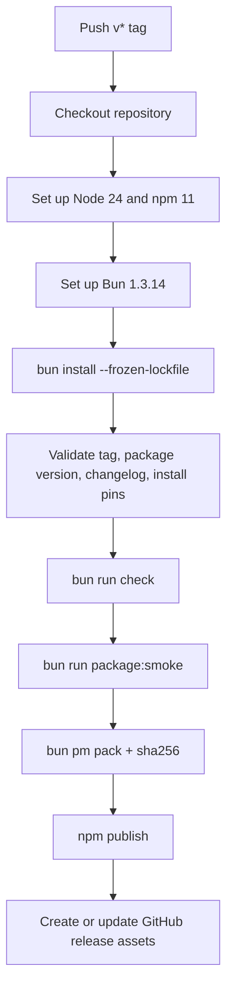

# Deployment

Deployment for this repo means publishing the npm package and GitHub release assets. The process is encoded in `.github/workflows/release.yml` and guarded by local package scripts in `package.json`.

## Release workflow

## CI workflow

`.github/workflows/ci.yml` runs on pull requests, pushes to `main`, weekly schedules, and manual dispatch. It includes:

- workflow syntax linting with `rhysd/actionlint:1.7.7`,
- `bun run check` on Ubuntu and macOS across Node 24 and 26,
- live OpenCode 1.18.3 smoke on Ubuntu Node 24,
- blocking Windows validation for platform-specific filesystem behavior.

The separate `opencode-compatibility.yml` workflow runs a non-blocking scheduled
live smoke against the latest OpenCode release.

## Release contract

The release job checks that:

- the tag name matches `package.json` version,
- `CHANGELOG.md` has a matching heading,
- `README.md` and `docs/troubleshooting.md` install snippets pin the same version,
- `bun run check` passes,
- `bun run package:smoke` passes,
- the packed tarball has a SHA-256 asset.

## Key source files

| File | Purpose |
| --- | --- |
| `.github/workflows/ci.yml` | Pull request and main-branch validation. |
| `.github/workflows/release.yml` | npm and GitHub release publishing. |
| `package.json` | Build, test, smoke, and package metadata. |
| `tests/package-smoke.test.ts` | Packed package contract. |
| `tests/live-opencode-smoke.test.ts` | Host integration smoke. |

Related pages: [CLI and package](systems/cli-and-package.md), [Testing](how-to-contribute/testing.md), and [Dependencies](reference/dependencies.md).
