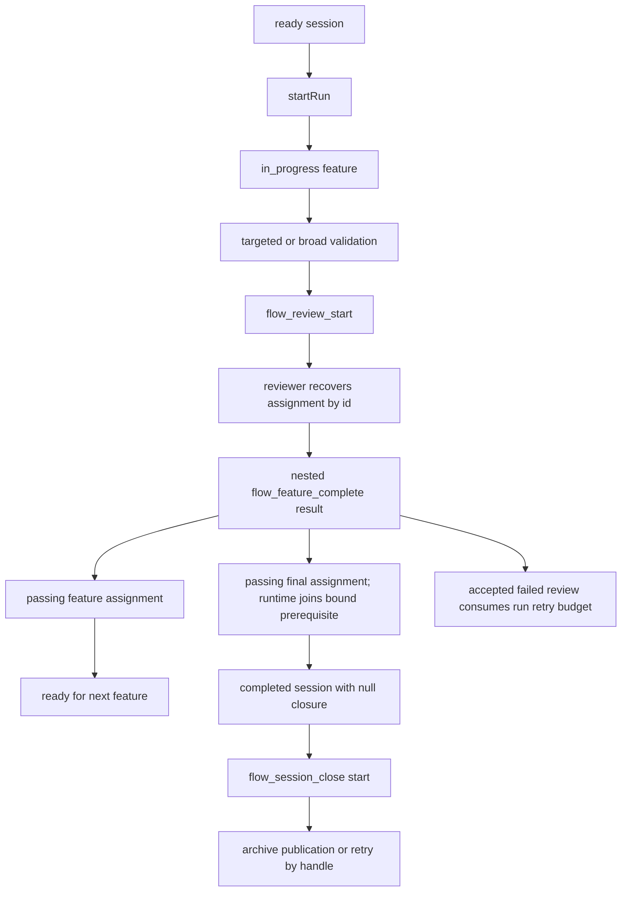

# Execution and completion

Active contributors: ddv1982

## Purpose

Execution runs one approved feature at a time and records source-bound validation
and runtime-owned review assignments before accepting a feature outcome.
`skills/flow-run/SKILL.md` guides implementation, while
`completeAssignedFeature` in `src/domain/transitions.ts` enforces the atomic
completion gate.

## Directory layout

```text
skills/flow-run/
├── SKILL.md
└── references/
    ├── validation-rubric.md
    └── audit-rubric.md
src/domain/transitions.ts
src/application/schema.ts
src/application/flow-service.ts
```

## Key abstractions

| Abstraction | File | Description |
| --- | --- | --- |
| `startRun` | `src/domain/transitions.ts` | Selects a runnable feature and creates its native execution epoch. |
| `startReviewAssignment` | `src/domain/transitions.ts` | Binds validation, source, packet, attempt, and required-depth identity. |
| `completeAssignedFeature` | `src/domain/transitions.ts` | Atomically records a completed result or accepted review blocker. |
| `resetFeature` | `src/domain/transitions.ts` | Closes the active run, invalidates its pending assignments, and resets the feature and dependents to `pending`. |
| `FlowFeatureCompleteToolSchema` | `src/application/flow-service.ts` | Validates the nested `completed` or `blocked` result. |
| `ExecutionHistoryEntrySchema` | `src/application/schema.ts` | Persists feature-run outcomes as validation-evidence and review-assignment references. |

## How it works



`startRun` chooses only pending features whose dependencies are complete and
refuses every session with a stored closure. Assignment creation derives all
causal identity at the trusted boundary. Feature outcome rejects missing or stale
assignments, changed source, invalid chronology, wrong validation scope, and
missing or differently bound final review without mutation or operation-id
consumption. A broad final outcome submits only the final-assignment result;
Flow reads the feature result from its durable bound prerequisite and records
both atomically. The final outcome does not create closure; explicit close owns
quiescent closure and archive publication.

When a same-source final review must be retried after context loss, detail
status exposes the first durable binding at
`workflowData.projection.finalReviewRetry.prerequisite.result`. The manager
copies that value unchanged into the replacement final assignment's
`request.featureReview`; compact and reviewer views deliberately omit it. A
source edit instead begins a new targeted feature-review sequence.

Reported times follow active-execution start, validation, assignment start, and
result order and cannot postdate runtime acceptance. Broad final validation
starts no earlier than the bound feature-assignment result.

## Integration points

`skills/flow-run/SKILL.md` tells agents to use `flow-test` for complex validation
and `flow-review` before recording completion. The application and domain do
not know those helper details; they see only validation observations, durable
assignment results, and the nested completion contract.

## Key source files

| File | Purpose |
| --- | --- |
| `skills/flow-run/SKILL.md` | Execution rules and completion payload example. |
| `src/domain/transitions.ts` | Runnable feature selection, completion, reset, and close gates. |
| `src/application/flow-service.ts` | Tool handlers for start, complete, reset, and close. |
| `tests/runtime-gates.test.ts` | Completion, final feature, blocker, and reset tests. |

## Entry points for modification

Change `skills/flow-run/SKILL.md` for execution behavior. Change
`startReviewAssignment` or `completeAssignedFeature` for hard gate changes, and
update [Validation and review](../primitives/validation-and-review.md) when
payload requirements change.

Related pages: [Review and validation](review-and-validation.md), [Runtime state machine](../systems/runtime-state-machine.md), and [Flow tools](../api/flow-tools.md).
