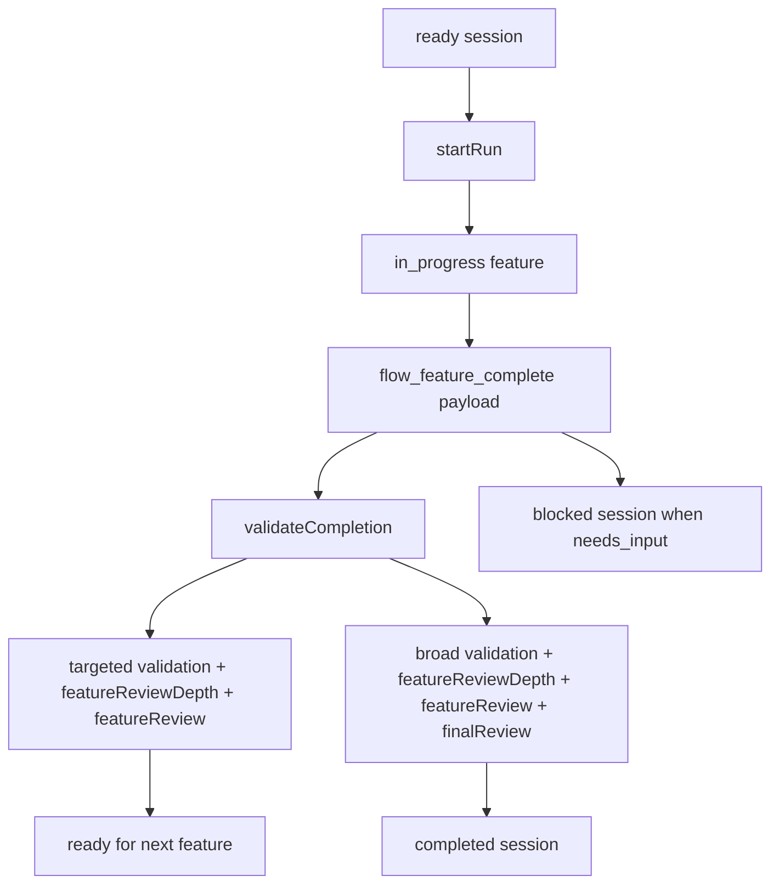

# Execution and completion

Active contributors: ddv1982

## Purpose

Execution runs one approved feature at a time and records real validation and review evidence before completion. `skills/flow-run/SKILL.md` guides implementation, while `completeFeature` in `src/runtime/transitions.ts` enforces the completion gate.

## Directory layout

```text
skills/flow-run/
├── SKILL.md
└── references/
    ├── validation-rubric.md
    └── audit-rubric.md
src/runtime/
├── api.ts
├── transitions.ts
└── schema.ts
```

## Key abstractions

| Abstraction | File | Description |
| --- | --- | --- |
| `startRun` | `src/runtime/transitions.ts` | Selects a runnable feature and marks it `in_progress`. |
| `completeFeature` | `src/runtime/transitions.ts` | Records `ok` or `needs_input` worker results. |
| `resetFeature` | `src/runtime/transitions.ts` | Resets a feature and dependents to `pending`. |
| `WorkerResultSchema` | `src/runtime/schema.ts` | Validates completion or blocker payloads. |
| `ExecutionHistoryEntrySchema` | `src/runtime/schema.ts` | Persists completion and blocker history. |

## How it works



`startRun` only chooses pending features whose dependencies are complete. It also refuses to continue across a phase boundary until the caller explicitly acknowledges a fresh continuation phase. `completeFeature` rejects missing validation, failed validation, wrong validation scope, too-shallow feature review depth, failed feature review, missing final review, failed final review, or final review depth that does not match the plan policy.

## Integration points

`skills/flow-run/SKILL.md` tells agents to use `flow-test` for complex validation and `flow-review` before recording completion. The runtime does not know those helper details; it only sees the evidence payload defined by `WorkerResultSchema` in `src/runtime/schema.ts`.

## Key source files

| File | Purpose |
| --- | --- |
| `skills/flow-run/SKILL.md` | Execution rules and completion payload example. |
| `src/runtime/transitions.ts` | Runnable feature selection, completion, reset, and close gates. |
| `src/runtime/api.ts` | Tool handlers for start, complete, reset, and close. |
| `tests/runtime-gates.test.ts` | Completion, final feature, blocker, and reset tests. |

## Entry points for modification

Change `skills/flow-run/SKILL.md` for execution behavior. Change `validateCompletion` in `src/runtime/transitions.ts` for hard gate changes, and update [Validation and review](../primitives/validation-and-review.md) when payload requirements change.

Related pages: [Review and validation](review-and-validation.md), [Runtime state machine](../systems/runtime-state-machine.md), and [Flow tools](../api/flow-tools.md).
