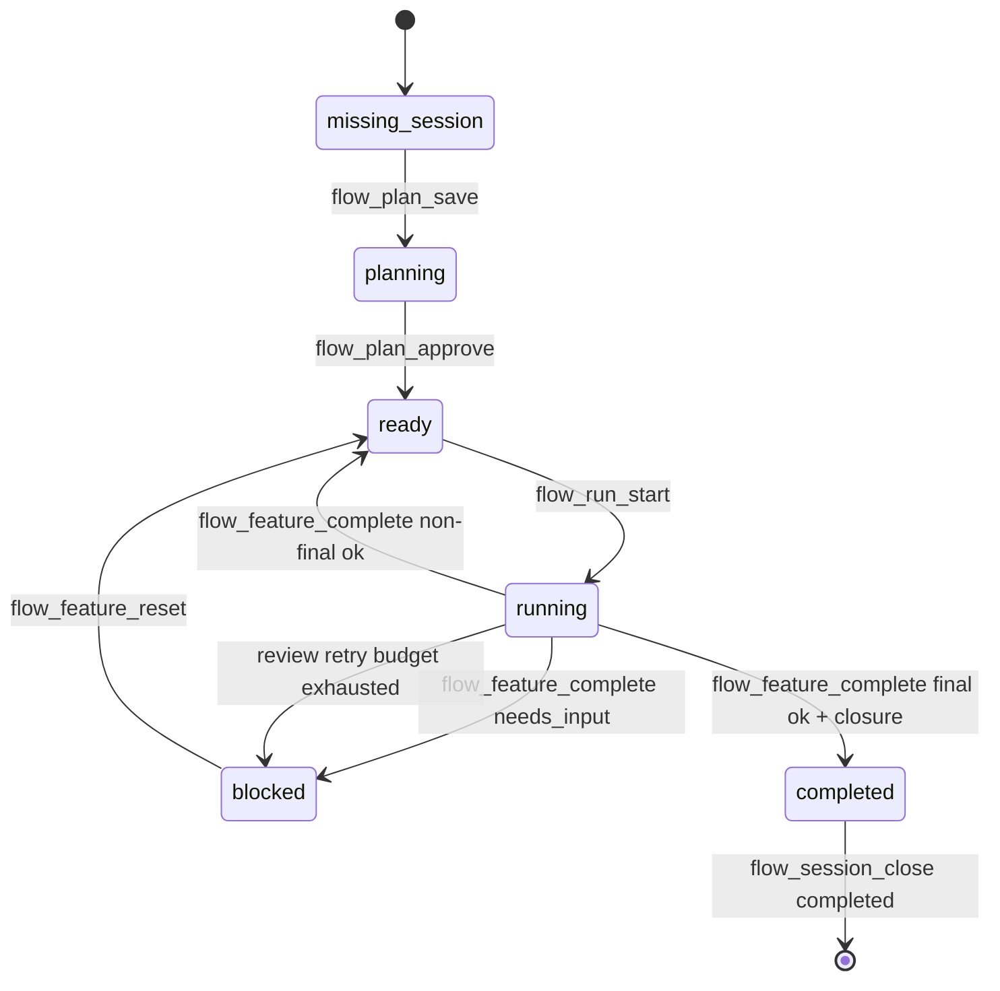

# Flow loop

Active contributors: ddv1982

## Purpose

The Flow loop is the end-to-end path from a user goal to an archived completed session. `skills/flow/SKILL.md` describes the manager behavior, while `src/application/flow-service.ts` and `src/domain/transitions.ts` enforce the state changes.

## Directory layout

```text
skills/flow/
├── SKILL.md
└── references/
    ├── recovery-playbook.md
    ├── parallel-orchestration.md
    ├── parallel-decision.md
    ├── parallel-manifest.md
    ├── parallel-execution.md
    ├── parallel-synthesis.md
    ├── parallel-pass-example.md
    └── handoff-format.md
src/domain/transitions.ts
src/application/flow-service.ts
src/infrastructure/fs/workspace-flow-service.ts
```

## Key abstractions

| Abstraction | File | Description |
| --- | --- | --- |
| `FlowService.status` | `src/application/flow-service.ts` | Reads the active session and next action. |
| `FlowService.planSave` | `src/application/flow-service.ts` | Creates a session and saves a draft plan. |
| `FlowService.runStart` | `src/application/flow-service.ts` | Starts the next runnable approved feature. |
| `FlowService.featureComplete` | `src/application/flow-service.ts` | Records completion or blocker evidence. |
| `FlowService.sessionClose` | `src/application/flow-service.ts` | Archives the active session. |

## How it works



The loop always starts by calling `flow_status`. The skill then plans, gets approval, runs one feature, validates it, obtains review packets, records completion, and repeats until the final feature passes broad validation and final review. Review retry exhaustion uses the ordinary blocked-feature path. Any stored closure makes the session archive-only until `flow_session_close` succeeds.

## Integration points

The loop depends on command preflight in `src/platform/opencode/plugin.ts` so public commands carry bundled instructions. Each canonical command calls `flow_status` before acting, loading the sole active state representation explicitly instead of relying on ambient projected context.

## Key source files

| File | Purpose |
| --- | --- |
| `skills/flow/SKILL.md` | End-to-end loop rules, hard gates, and recovery guidance. |
| `src/application/flow-service.ts` | Tool handlers used by the loop. |
| `src/domain/transitions.ts` | Session state machine. |
| `tests/runtime-gates.test.ts` | Runtime loop gate coverage. |

## Entry points for modification

Change `skills/flow/SKILL.md` for manager behavior and recovery instructions. Change `src/domain/transitions.ts` only when a hard gate or state transition needs to change, and add tests in `tests/runtime-gates.test.ts`.

Related pages: [Planning and approval](planning-and-approval.md), [Execution and completion](execution-and-completion.md), and [Session, plan, and feature](../primitives/session-plan-feature.md).
