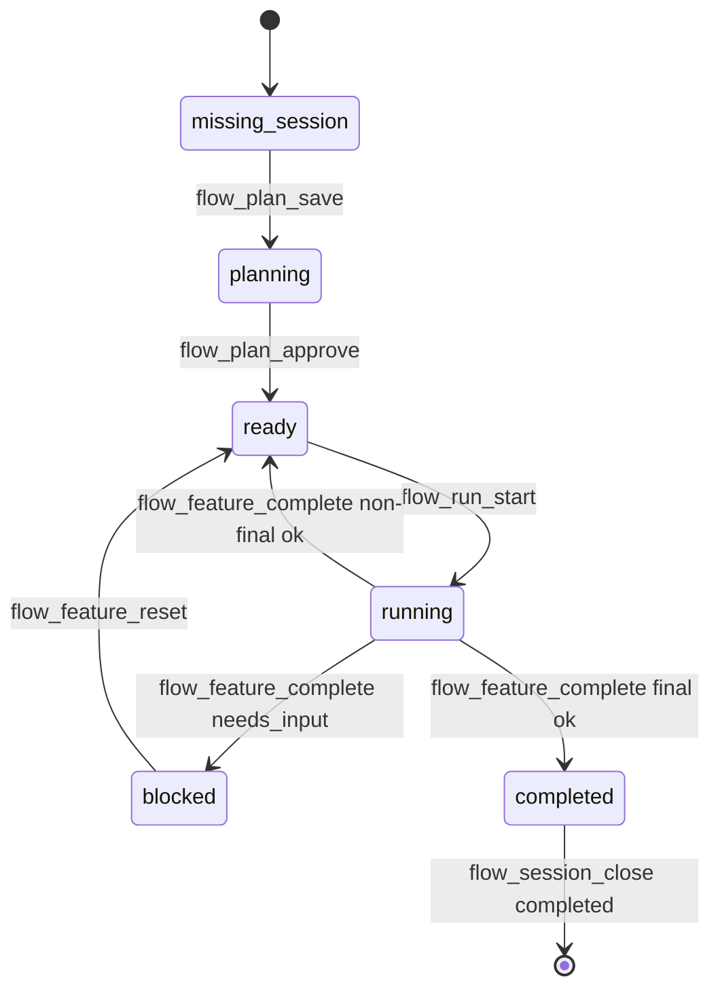

# Flow loop

Active contributors: ddv1982

## Purpose

The Flow loop is the end-to-end path from a user goal to an archived completed session. `skills/flow/SKILL.md` describes the manager behavior, while `src/runtime/api.ts` and `src/runtime/transitions.ts` enforce the state changes.

## Directory layout

```text
skills/flow/
├── SKILL.md
└── references/
    ├── recovery-playbook.md
    ├── parallel-orchestration.md
    ├── parallel-pass-patterns.md
    ├── handoff-format.md
    └── verification-gates.md
src/runtime/
├── api.ts
├── transitions.ts
├── workspace.ts
└── schema.ts
```

## Key abstractions

| Abstraction | File | Description |
| --- | --- | --- |
| `flowStatus` | `src/runtime/api.ts` | Reads the active session and next action. |
| `flowPlanSave` | `src/runtime/api.ts` | Creates a session and saves a draft plan. |
| `flowRunStart` | `src/runtime/api.ts` | Starts the next runnable approved feature. |
| `flowFeatureComplete` | `src/runtime/api.ts` | Records completion or blocker evidence. |
| `flowSessionClose` | `src/runtime/api.ts` | Archives the active session. |

## How it works



The loop always starts by calling `flow_status`. The skill then plans, gets approval, runs one feature, validates it, obtains review payloads, records completion, and repeats until the final feature passes broad validation and final review.

## Integration points

The loop depends on command preflight in `src/adapters/opencode/plugin.ts` so public commands carry bundled instructions. It also depends on generated instructions from `src/runtime/workspace.ts`, which keep active session context visible to OpenCode through stable config.

## Key source files

| File | Purpose |
| --- | --- |
| `skills/flow/SKILL.md` | End-to-end loop rules, hard gates, and recovery guidance. |
| `src/runtime/api.ts` | Tool handlers used by the loop. |
| `src/runtime/transitions.ts` | Session state machine. |
| `tests/runtime-gates.test.ts` | Runtime loop gate coverage. |

## Entry points for modification

Change `skills/flow/SKILL.md` for manager behavior and recovery instructions. Change `src/runtime/transitions.ts` only when a hard gate or state transition needs to change, and add tests in `tests/runtime-gates.test.ts`.

Related pages: [Planning and approval](planning-and-approval.md), [Execution and completion](execution-and-completion.md), and [Session, plan, and feature](../primitives/session-plan-feature.md).
