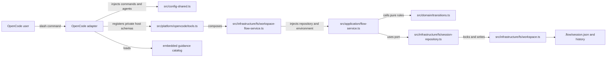
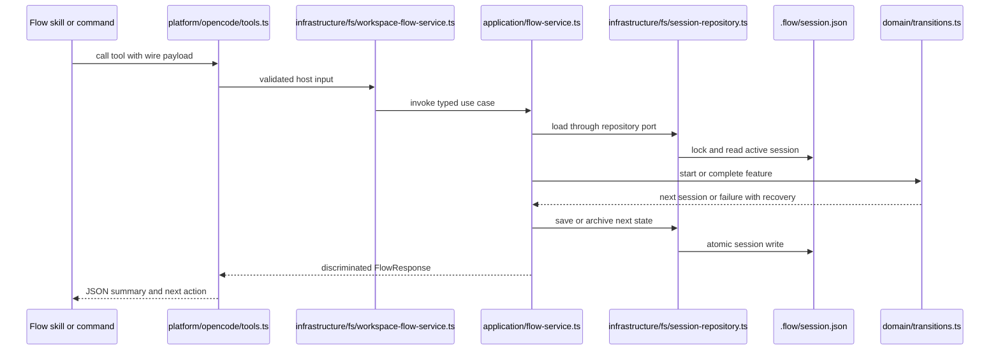

# Architecture

Flow v5 separates workflow policy from transport and persistence. OpenCode calls
the package entrypoint in `src/index.ts`; `src/platform/opencode/plugin.ts`
composes the host transport with a filesystem-backed application service; and
state changes reach pure transitions in `src/domain/transitions.ts` through an
application repository port.

## Component map

## Inward boundaries

`src/domain/**` contains no host, filesystem, clock, or UUID dependencies.
`src/application/**` depends only on the domain and its own ports. The filesystem
implementation lives under `src/infrastructure/**`; it supplies the clock and
ID environment, locking, strict JSON, persistence, archive publication, and
workspace safety.

## OpenCode boundary

The platform in `src/platform/opencode/plugin.ts` is the only OpenCode plugin entrypoint. It:

- serves package-owned guidance from `src/guidance/catalog.ts`,
- registers the config hook from `src/platform/opencode/config.ts`,
- registers tools from `src/platform/opencode/tools.ts`,
- expands Flow slash commands through `command.execute.before`.

Host schemas use the validator exported by `@opencode-ai/plugin` and remain
private. Application and persistence schemas use Flow's direct `zod`
dependency. Contract fixtures verify that the two boundaries accept and reject
the same payloads without mixing their schema types.

## Data flow for a feature run

The dependency direction is documented in
`docs/architecture/allowed-cross-layer-dependencies.md` and enforced by
`tests/architecture-boundaries.test.ts`.

## Key source files

| File | Purpose |
| --- | --- |
| `src/index.ts` | Exports the OpenCode plugin. |
| `src/platform/opencode/plugin.ts` | Stable plugin hooks and command preflight. |
| `src/config-shared.ts` | Public commands, hidden workers, and config mutation. |
| `src/application/flow-service.ts` | Typed application service and input schemas. |
| `src/domain/session.ts` | Branded domain values and session model. |
| `src/domain/transitions.ts` | Pure state machine and completion gates. |
| `src/infrastructure/fs/workspace-flow-service.ts` | Filesystem-backed application composition. |
| `src/infrastructure/fs/workspace.ts` | Persistence, lock, archive, and recovery layer. |
| `src/guidance/catalog.ts` | Stable guidance ids and embedded Markdown. |
| `src/distribution/legacy-cleanup.ts` | Explicit recoverable cleanup for old global folders. |

Related pages: [Runtime state machine](../systems/runtime-state-machine.md), [OpenCode adapter](../systems/opencode-adapter.md), and [Workspace persistence](../systems/workspace-persistence.md).
