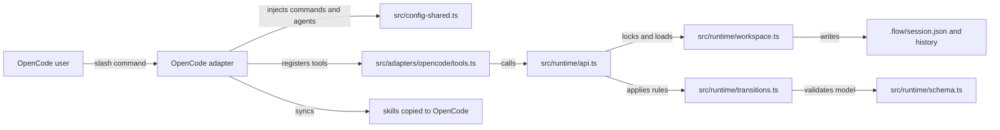
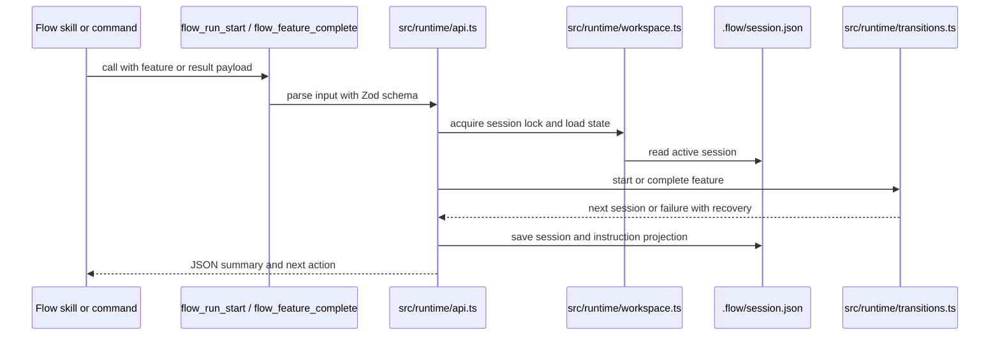

# Architecture

Flow is split into a small runtime and a larger skills bundle. OpenCode calls the plugin in `src/index.ts`, the adapter wires Flow into OpenCode in `src/adapters/opencode/plugin.ts`, and runtime state changes pass through `src/runtime/api.ts` before reaching pure transitions in `src/runtime/transitions.ts`.

## Component map

## Runtime boundary

The runtime is host-neutral. `src/runtime/schema.ts` defines the persisted session, plan, feature, validation, and review shapes. `src/runtime/transitions.ts` enforces approval, dependency, active-feature, validation, review, reset, and close rules without importing OpenCode code. `src/runtime/workspace.ts` handles filesystem safety and generated instruction projection.

## OpenCode boundary

The adapter in `src/adapters/opencode/plugin.ts` is the only runtime-facing OpenCode plugin entrypoint. It:

- runs managed skill sync through `runFlowSkillSync` from `src/distribution/sync.ts`,
- registers the config hook from `src/adapters/opencode/config.ts`,
- registers tools from `src/adapters/opencode/tools.ts`,
- expands Flow slash commands through `command.execute.before`,

## Data flow for a feature run

## Size snapshot

As of 2026-07-02, the repo has about 6,503 TypeScript lines across 23 files and 4,120 Markdown lines across 38 files, excluding `node_modules`, `dist`, and Git internals. The codebase is small enough that the architecture relies on import boundaries documented in `docs/architecture/allowed-cross-layer-dependencies.md` rather than a custom seam checker.

## Key source files

| File | Purpose |
| --- | --- |
| `src/index.ts` | Exports the OpenCode plugin. |
| `src/adapters/opencode/plugin.ts` | Stable plugin hooks and command preflight. |
| `src/config-shared.ts` | Public commands, hidden workers, and config mutation. |
| `src/runtime/api.ts` | Runtime tool handlers and input schemas. |
| `src/runtime/transitions.ts` | State machine and completion gates. |
| `src/runtime/workspace.ts` | Persistence, lock, archive, and recovery layer. |
| `src/distribution/sync.ts` | Skill installation, doctor reports, and uninstall logic. |

Related pages: [Runtime state machine](../systems/runtime-state-machine.md), [OpenCode adapter](../systems/opencode-adapter.md), and [Workspace persistence](../systems/workspace-persistence.md).
