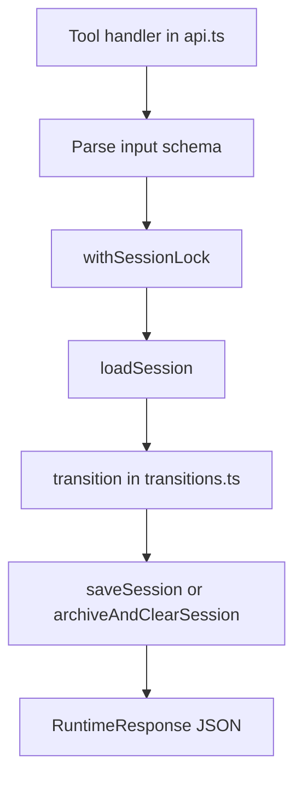

# Runtime state machine

Active contributors: ddv1982

## Purpose

The runtime state machine enforces Flow's hard safety gates. `src/runtime/api.ts` handles tool inputs and persistence, while `src/runtime/transitions.ts` contains pure transition logic for plans, runs, completion, reset, close, and status summaries.

## Directory layout

```text
src/runtime/
├── api.ts
├── transitions.ts
├── schema.ts
├── workspace.ts
└── time.ts
```

## Key abstractions

| Abstraction | File | Description |
| --- | --- | --- |
| `mutate` | `src/runtime/api.ts` | Lock, load, transition, and save wrapper. |
| `createSession` | `src/runtime/transitions.ts` | Creates a version 2 planning session. |
| `applyPlan` | `src/runtime/transitions.ts` | Validates and applies a draft plan. |
| `startRun` | `src/runtime/transitions.ts` | Starts the next runnable feature. |
| `completeFeature` | `src/runtime/transitions.ts` | Records completion or blocker history. |
| `summarizeSession` | `src/runtime/transitions.ts` | Produces `flow_status` output. |

## How it works



`src/runtime/transitions.ts` does not write files. It returns either `{ ok: true, value }` or `{ ok: false, message, recovery, session }`. `src/runtime/api.ts` decides whether to persist a successful next state, save a failure state with `lastError`, quarantine unreadable sessions, or archive closed sessions.

## Integration points

The adapter calls runtime functions through `src/adapters/opencode/tools.ts`. The tests in `tests/runtime-gates.test.ts` exercise the state machine through the public API functions, not by mutating session objects directly.

## Key source files

| File | Purpose |
| --- | --- |
| `src/runtime/api.ts` | Tool-facing API and mutation wrapper. |
| `src/runtime/transitions.ts` | Pure state machine. |
| `src/runtime/schema.ts` | Session and payload schemas. |
| `tests/runtime-gates.test.ts` | State gate behavior coverage. |

## Entry points for modification

Add a new hard gate in `src/runtime/transitions.ts`, then add API-level tests in `tests/runtime-gates.test.ts`. Avoid adding planning heuristics here; put those in `skills/flow-plan/SKILL.md` or related skill files.

Related pages: [Execution and completion](../features/execution-and-completion.md), [Schema and JSON](schema-and-json.md), and [Flow tools](../api/flow-tools.md).
