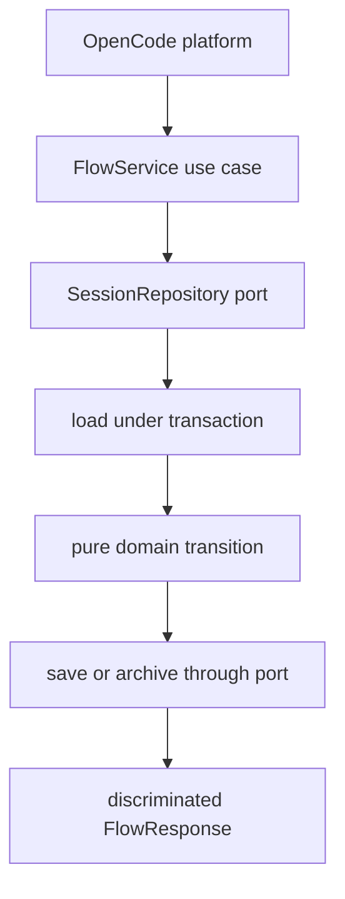

# Runtime state machine

Active contributors: ddv1982

## Purpose

The state machine enforces Flow's hard safety gates. The application service
parses core inputs and coordinates a repository port, while domain transitions
contain pure logic for plans, runs, completion, reset, close, and status.

## Directory layout

```text
src/domain/session.ts
src/domain/transitions.ts
src/application/flow-service.ts
src/application/ports/session-repository.ts
```

## Key abstractions

| Abstraction | File | Description |
| --- | --- | --- |
| `createFlowService` | `src/application/flow-service.ts` | Builds typed use cases over an injected repository and environment. |
| `createSession` | `src/domain/transitions.ts` | Creates a version 3 planning session. |
| `applyPlan` | `src/domain/transitions.ts` | Validates and applies a draft plan. |
| `startRun` | `src/domain/transitions.ts` | Starts the next runnable feature. |
| `completeFeature` | `src/domain/transitions.ts` | Records completion or blocker history. |
| `compactSessionProjection` | `src/domain/transitions.ts` | Produces bounded routing status. |
| `executionSessionProjection` | `src/domain/transitions.ts` | Produces full active-feature working scope. |

## How it works



Domain transitions do not write files or read time and UUIDs directly. They
return typed success or failure values. The application service decides whether
to persist a successful next state, save a failure state with `lastError`, ask
the repository to quarantine unreadable state, or archive a closed session.

## Integration points

The platform calls the filesystem composition in
`src/infrastructure/fs/workspace-flow-service.ts`. Application-level domain
tests inject deterministic time and IDs; workspace tests exercise the real
repository implementation.

## Key source files

| File | Purpose |
| --- | --- |
| `src/application/flow-service.ts` | Tool-facing API and mutation wrapper. |
| `src/domain/transitions.ts` | Pure state machine. |
| `src/application/schema.ts` | Session and payload schemas. |
| `tests/runtime-gates.test.ts` | State gate behavior coverage. |

## Entry points for modification

Add a new hard gate in `src/domain/transitions.ts`, then add API-level tests in `tests/runtime-gates.test.ts`. Avoid adding planning heuristics here; put those in `skills/flow-plan/SKILL.md` or related skill files.

Related pages: [Execution and completion](../features/execution-and-completion.md), [Schema and JSON](schema-and-json.md), and [Flow tools](../api/flow-tools.md).
